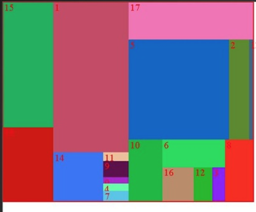
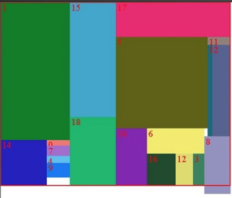

# ElsaRiddle

### TimeFrame: 2 Days

## The Task:
Write and Implement a general algorithm that can be used for packing rectangles of random sizes into the smallest square or rectengle possibe
#### To be written in the language of your choosing

### Input:
you'll get a json with a couple of Sets, containing N rectangels with random side lengths i.e:

each Set is a list, comprising of rectengles side lengths

    {
      'ExampleSetA': [[17, 10], [15, 19], [15, 14], [19, 21], [1, 9], [6, 25], [3, 17]],
      'ExampleSetB': [[7, 9], [29, 14], [16, 3], [27, 23], [8, 19], [13, 6], [10, 26]], 
      'ExampleSetC': [[15, 9], [23, 19], [30, 16], [21, 2], [13, 18], [15, 7], [14, 29]], 
      'ExampleSetD': [[30, 29], [20, 18], [17, 28], [20, 13], [17, 11], [30, 4], [27, 27]], 
      'ExampleSetE': [[1, 27], [9, 21], [14, 2], [20, 29], [4, 22], [10, 26], [12, 1]
    }
    
### Output
For every Set, generate an image showing the most optimal ordering of the set's rectangles

(so for these examples, 5 images should be generated)
#### BoundingPerimeter/TotalArea - should be minimals

### Optimal

### Not Optimal

Finally, please put readable Text on this image containing data about the set

    * Length of BoundingPerimeter             
    * Area of missing/unfilled/extra space    -  should be minimal
    * TotalArea (recs area + missing spaces)  
    * Missing Space as % of the Area          -  should be minimal
    * Perimeter to Area Ratio                 -  should be minimal
